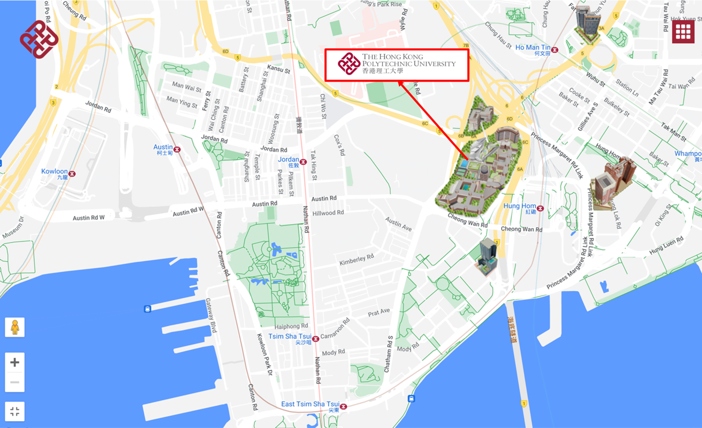
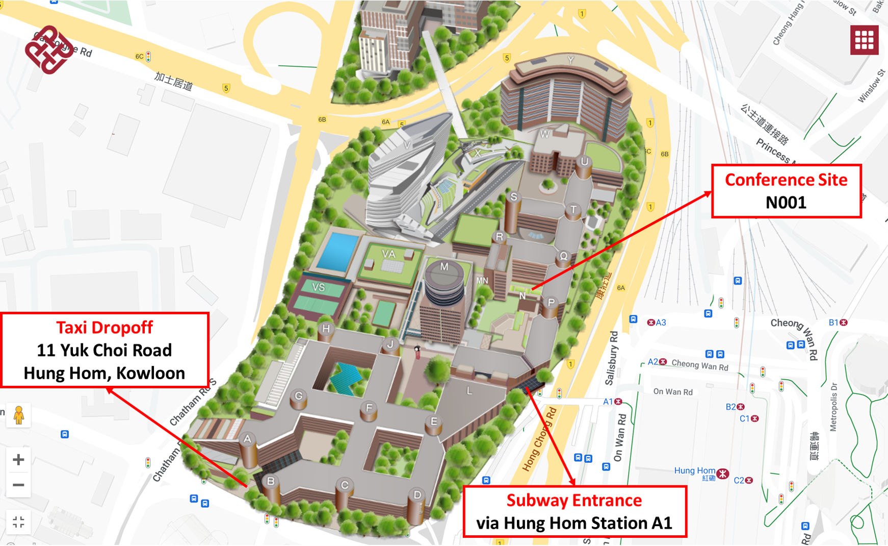

# **Registration**

Please click on the following link to register for the conference: [Registration Link](https://www.hkws.org/registration/tamc2024/reg.html).

## Registration Fee

|**Date**|**Full**|**Student**|
|:-:|:-:|:-:|
|Early: March 31, 2024|4,500HKD$| 3,800HKD$|
|Late|5,500HKD$|4,800HKD$|

At least one author of each accepted paper must register to ensure that the paper will be included in the TAMC 2024 conference proceedings. Note that each paper requires at least one unique (full or student) registration.  

Payment of full or student registration fee covers the cost to attend all keynote sessions and technical sessions, coffee breaks, conference banquet, and all lunches during the conference. 

Student registration is available only for full-time students. If you register as a student, you must provide a reasonable certificate from your university (like a student ID). Please send a copy of the certificate and the registration form to <tamc2024chairs@gmail.com>.

## Attending
### Location
Find the conference site at Lecture Theatres - N001, The Hong Kong Polytechnic University, Hung Hom, Kowloon, Hong Kong.

### Transportation from Airport to PolyU
- **By MTR**
First take Airport Express from Hong Kong International Airport to Tsing Yi Station. Next interchange to Tung Chung Line for Hong Kong Station at Tsing Yi Station Platform 4. Then interchange to Tuen Ma Line for Wu Kai Sha Station at Nam Cheong Station Platform 2. Get off at Hung Hum Station and take the footbridge at Exit A1 to the campus. A single journey takes around 40 minutes for the ride and costs 65HKD (with Octopus) / 81.5HKD (without Octopus). For more details, please read the MTR website.

- **By Bus**
Take Cityflyer route A21 from Airport (Ground Transportation Centre) Bus Terminus to Hung Hom Station. Take the footbridge at Hung Hom Station Exit A1 that leads you to the campus. It takes around 75 mins for the ride and costs HK$33. For more details, please read the  Citybus & NWFB website

- **By Taxi**
Take Urban red taxis to go to PolyU and drop off at the main entrance at Wan Road. It costs around HK$280 and takes around 45 mins for the ride. Additional charges occur for large baggage. The toll and return toll are both payable by a passenger for cross-harbor hiring. For details, please read TAXI FARE . You’ll want to carry some cash as most of the taxis cannot or will not accept credit card payments for fares.

## Accommodation

### Exclusive Offer

- Hotel lcon, Hung Hom, Hong Kong

View the "Exclusive Offer for The Hong Kong Polytechnic University" by using the code "POLYUSA" from the official site. Please check the hotel websites for details and make a reservation directly with the hotel.

### Other Options Near the Conference Venue

- Best Western Plus Hotel Kowloon, 73-75 Chatham Rd S, Tsim Sha Tsui, Hong Kong
- Regal Kowloon Hotel, 71 Mody Rd, Tsim Sha Tsui East, Hong Kong
- Harbour Plaza Metropolis, 7 Metropolis Dr, Hung Hom, Hong Kong
- Empire Hotel Kowloon, 62 Kimberley Rd, Tsim Sha Tsui, Hong Kong
- The Bauhinia Hotel, 9 Observatory Ct, Tsim Sha Tsui, Hong Kong
- Popway Hotel, 117 Chatham Rd S, Tsim Sha Tsui, Hong Kong
- The Emperor Hotel, 373 Queen's Road East, Wanchai, Hong Kong

Please check the hotel websites for details and make a reservation directly with the hotel.

### Other Options for Budget Travelers

- Caritas Bianchi Lodge, 4 Cliff Rd, Yau Ma Tei, Hong Kong

Please check the hotel websites for details and make a reservation directly with the hotel.